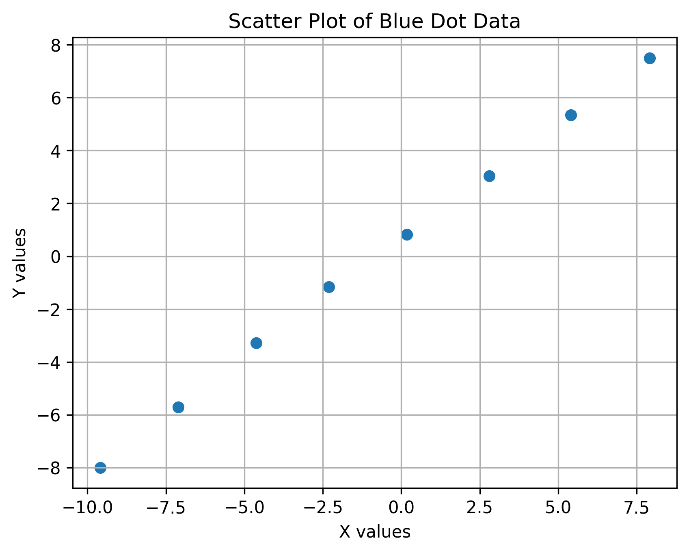

# Midterm

**Assignment 1 – Finding Pearson’s Correlation Coefficient**

The data points were collected manually from the interactive graph available at max.ge/aiml_midterm/69428_html by hovering over each blue dot and recording the displayed (x,y)coordinates. I wrote the (x,y)coordinates into a CSV file from which the Python code will read them.

To measure the relationship between the two variables, Pearson’s correlation coefficient was used. Pearson’s correlation coefficient quantifies the strength and direction of a linear relationship between two numerical variables.The solution is provided in Python code in the "Task 1 - https://github.com/trokhvadze25/aimlmid2026_t_rokhvadze25/blob/5f86f9ad86057235f75eb769d46c89821c42dd30/Task%201/Correlation.py " folder.

The calculation process is as follows:
	First, the mean value of all x values and the mean value of all y values are calculated.
	For each data point, the deviation of x from its mean and the deviation of y from its mean are computed.
	The covariance between xand y is obtained by summing the products of these deviations.
	This covariance is then normalized by dividing it by the product of the standard deviations of x and y.
	The resulting value is Pearson’s correlation coefficient r, which ranges between -1 and +1.
Using this method, the calculated Pearson correlation coefficient for the given data is: r≈0.9997

This value indicates a very strong positive linear correlation. As the value of x increases, the value of y also increases in an almost perfectly linear manner. This conclusion is further supported by the scatter plot, which shows the data points forming an almost straight line with a positive slope.

Visualisation :





**Assignment 2 – Spam Email Detection**


**Training Dataset**

The dataset used in this assignment is available in the GitHub repository at the following link:

https://github.com/trokhvadze25/aimlmid2026_t_rokhvadze25/blob/e57e2f8b9f629218ef9ad130355b16fc4c4a00f2/Task%202/data/t_rokhvadze25_69428.csv

The dataset contains numerical email features along with a class label indicating whether an email is spam (1) or legitimate (0).

The features included in the dataset are:

words – total number of words in the email

links – number of hyperlinks

capital_words – number of fully capitalized words

spam_word_count – number of common spam-related words

is_spam – target label (spam or legitimate)

Uploading the dataset to the repository ensures reproducibility and transparency of the experiment.


**Data Loading and Processing**

The dataset is loaded using the pandas library. After loading, the data is divided into two main components:

Features (X): numerical attributes describing email characteristics

Target (y): email class (is_spam), indicating spam or legitimate emails

To evaluate the model fairly, the dataset is split into training and testing subsets.
Seventy percent (70%) of the data is used for training the model, while the remaining thirty percent (30%) is reserved for validation.
This approach allows the model to be evaluated on data it has not seen during training.


```
data = pd.read_csv("data/t_rokhvadze25_69428.csv")

X = data.drop(columns=["is_spam"])
y = data["is_spam"]

X_train, X_test, y_train, y_test = train_test_split(
    X, y, test_size=0.3, random_state=42
)
```


**Logistic Regression Model**

Logistic Regression is used as the classification algorithm because it is well suited for binary classification problems, such as distinguishing between spam and legitimate emails.

The model learns a linear combination of the input features and applies a logistic (sigmoid) function to estimate the probability that an email belongs to the spam class.


```
model = LogisticRegression(max_iter=1000)
model.fit(X_train, y_train)
```


**Model Coefficients**

After training, the coefficients of the Logistic Regression model are extracted. Each coefficient represents the influence of a specific feature on the probability that an email is classified as spam.

Positive coefficient: increases the likelihood of spam

Negative coefficient: decreases the likelihood of spam


```
for feature, coef in zip(X.columns, model.coef_[0]):
    print(feature, coef)

print("Intercept:", model.intercept_)
```

These coefficients provide insight into which email features contribute most strongly to spam detection.


**Model Validation**

The trained model is validated using data that was not used for training. Two evaluation metrics are calculated:

Confusion Matrix: shows correct and incorrect classifications

Accuracy: measures the proportion of correctly classified emails


```
y_pred = model.predict(X_test)

cm = confusion_matrix(y_test, y_pred)
accuracy = accuracy_score(y_test, y_pred)
```

The confusion matrix includes:

True Positives: correctly classified spam emails

True Negatives: correctly classified legitimate emails

False Positives: legitimate emails classified as spam

False Negatives: spam emails classified as legitimate

Accuracy provides an overall measure of the model’s performance.


**Email Text Classification Capability**

The application is capable of classifying new email text provided by the user.
The email text is parsed, and the same features used in the dataset are extracted from the raw text.

```
def extract_features(text):
    text_lower = text.lower()
    words = len(text.split())
    links = text_lower.count("http")
    capital_words = sum(1 for w in text.split() if w.isupper())
    spam_word_count = (
        text_lower.count("free")
        + text_lower.count("win")
        + text_lower.count("urgent")
        + text_lower.count("money")
    )
    return [words, links, capital_words, spam_word_count]
```


These extracted features are then passed to the trained model to determine whether the email is spam or legitimate.

```
def classify_email(text):
    features = extract_features(text)
    prediction = model.predict([features])[0]
    return "SPAM" if prediction == 1 else "LEGITIMATE"
```


**Manually Composed Spam Email**

Subject: FREE MONEY – Act Now!

You won free money! Click the link below to claim your prize:
http://spam-link.example

Explanation:
This email was intentionally designed to resemble spam by including promotional language, urgency, capitalized words, and a suspicious hyperlink. These characteristics align with features commonly associated with spam emails in the dataset.


**Manually Composed Spam Email**

**Subject:** FREE MONEY – Act Now!

You won free money! Click the link below to claim your prize:
http://spam-link.example


This email was intentionally designed to resemble spam by including promotional language, urgency, capitalized words, and a suspicious hyperlink. These characteristics align with features commonly associated with spam emails in the dataset.


**Visualization – Class Distribution**


A bar chart is generated to show the number of spam and legitimate emails in the dataset.
This visualization helps identify whether the dataset is balanced or imbalanced


The chart reveals the relative proportion of spam and legitimate emails, which is important for understanding how class imbalance may affect model performance.


