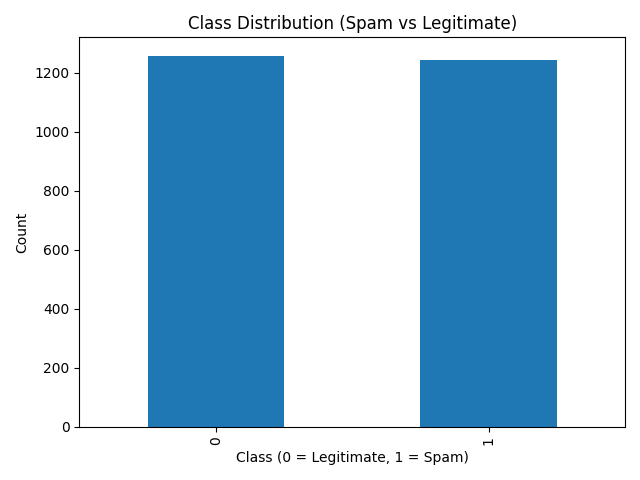

# Task 2 – Email Spam Classification

## Dataset
Upload the provided dataset to:
data/t_rokhvadze25_69428.csv

## Data Loading and Processing
The dataset is loaded using pandas. Feature columns are separated from the
target column (`class`). The data is split into 70% training and 30% testing sets.

## Logistic Regression Model
Logistic Regression is used because the task is binary classification.
The model is trained on 70% of the data.

## Model Coefficients
Model coefficients and intercept are printed by the application and indicate
feature influence on spam probability.

## Validation
The model is validated using Accuracy and a Confusion Matrix on unseen data.

## Email Classification
The application can classify raw email text by extracting features and
applying the trained model.

### Spam Email Example
"You won free money! Click http://spam.link now!"

### Legitimate Email Example
"Hello team, our meeting is scheduled for tomorrow."

## Visualizations

